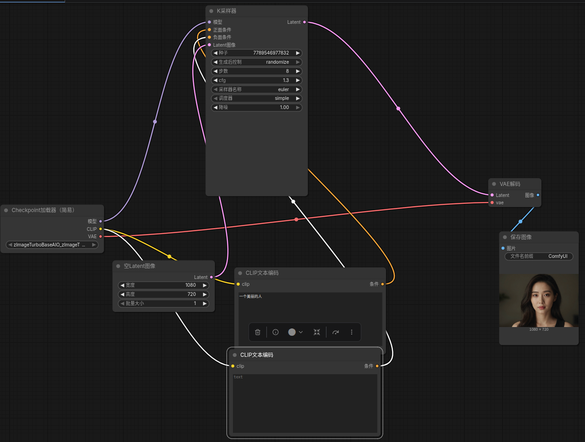

# 现在越来越多的Aigc的模型我们该在linux上玩以z-image-turbo为例子

## 为什么选择z-image-turbo

[Z-Image-Turbo](https://www.google.com/search?q=Z-Image-Turbo&sca_esv=f6b88a89bb20681d&biw=1920&bih=999&sxsrf=ANbL-n5jD7-uljPhwfe4lW9_EVS1u-k06w%3A1772033322873&ei=KhWfaYaBNaWH0PEPsqb_uAs&oq=z-image-turboshi&gs_lp=Egxnd3Mtd2l6LXNlcnAiEHotaW1hZ2UtdHVyYm9zaGkqAggBMgUQABiABDIFEAAYgAQyBRAAGIAEMgUQABjvBTIIEAAYgAQYogQyBRAAGO8FMgUQABjvBTIFEAAY7wVI_R1QhgNY1xBwAHgCkAEAmAHuAaAB9wyqAQMyLTe4AQHIAQD4AQGYAgWgAsAHwgIEEAAYR8ICChAjGIAEGCcYigWYAwCIBgGQBgqSBwUxLjAuNKAHlhmyBwMyLTS4B70HwgcDMC41yAcIgAgA&sclient=gws-wiz-serp&mstk=AUtExfDAtcnsjMEHU4yWvTmK2NyE7ts6fBi2tnpbRRwT4CcqQ4muGAKKinbniqOgFElUzfZxVLXEBL6-SJuzpWdpxxoEL2OsejP7OP7-caqOo0SEQC-P2K-rtezs_wyR5URLgIvXD85HcBKUVRIRaJGq_vi7XYUhLKI0VvlN4IIMFEx8wBuqY_K2f08GVnepp56_Cn0xi1ZTLzOb2wHKyJu4D2NjzfUcHUGI9LyGVG2z78HC14NOraoPA0T8tGo0Oqu-L-X6azSTJstR1Fii9R7AdM_E&csui=3&ved=2ahUKEwjAop7I-vSSAxVgOTQIHRblA4UQgK4QegQIARAB) 是由阿里巴巴通义实验室（Tongyi Lab）开发的开源高性能图像生成模型，属于Z-Image系列。它基于60亿参数架构，通过先进的蒸馏技术（如Decoupled-DMD），在仅需8步推理、小于1秒的亚秒级速度下生成高质量图片，特别擅长中英文本渲染、真实感及人像生成，可在消费级GPU上运行。

 

**核心特性：**

- **极致速度与效率：** 采用蒸馏技术，仅需8个推理步骤（NFE），在企业级和消费级显卡上均能实现亚秒级生成。
- **硬件要求低：** 显存要求<16GB，消费级显卡即可轻松运行。
- **卓越画质：** 尽管轻量化，但其生成的图像真实感强，文字渲染能力强，在开源模型中表现优异。
- **支持中文：** 相比其他主流模型，对中文字符的识别和渲染更加精准。
- **兼容性：** 适配 [ComfyUI](https://www.youtube.com/watch?v=qHqRSXB4xPQ) 等主流工具，方便用户集成和使用。

## 为什么选择linux?

ComfyUI 和 Linux 简直是“天作之合”。虽然 Windows 也能跑，但在 Linux（尤其是 Ubuntu 或 Arch）上，你会感觉到一种从“能用”到“好用”的质变。

以下是Linux系统的核心优势：

### 1.显存管理更高效（VRAM管理）

这是最重要的原因。Windows 系统本身会占用大量显存（即使你什么都不做，系统 UI 和后台进程也会吃掉 0.5GB 到 1.5GB 的 VRAM）。

- **Linux 的优势：**在不运行桌面环境（Headless）或使用轻量级桌面时，系统对显存的占用几乎可以忽略不计。
- **结果：**你可以用同样的显卡跑更大的模型（如 SD3 或 Flux），或者设置更高的 Batch Size 而不易出现`Out of Memory (OOM)`错误。

### 2. PyTorch 的原生支持

PyTorch（ComfyUI 的核心引擎）是在Linux环境下优先开发的。

- **xformers 与 Flash 注意：**这些加速算子在 Linux 上的编译和安装通常比 Windows 顺滑剃须。
- **Triton 支持：**很多高性能的采样器和加速插件依赖`Triton`。虽然 Windows 逐渐开始支持，但在 Linux 上它是“开箱即用”且性能最稳定的。

### 3. I/O性能与软链接

ComfyUI玩家通常会有几十GB甚至几个TB的模型文件。

- **文件系统：** Linux 的 ext4 或 xfs 文件系统在处理大量小文件和超大模型文件时，读取速度通常赶上 Windows 的 NTFS。
- **软链接（Symbolic Links）：** Linux处理软链接非常优雅。如果你有多个AI工具（如WebUI、ComfyUI、Kohya_ss），你可以轻松地用一行命令让它们共享同一个模型文件夹，而不会出现权限或路径识别的幺蛾子。

### 4. 远程部署与自动化

ComfyUI 的本质是一个 Web 服务。

- **生产力工具：** Linux让你能够轻松地在后台挂起进程（使用`screen`或`tmux`），或者将其配置作为系统服务。
- **SSH 访问：**你可以在性能强大的 Linux 工作站上运行 ComfyUI，然后在平板、轻薄本甚至手机上通过浏览器流畅操作，这种“前后台分离”的体验在 Linux 上自然而然地发挥作用。

## 如何安装

我推荐使用miniconda来管理linux环境因为我一直使用miniconda我知道它的优势

```
# 创建并激活 Python 3.11 专属环境
conda create -n comfyui python=3.11 -y
conda activate comfyui

# 安装支持 CUDA 12.4 的 PyTorch (Linux 环境下的最佳选择)
pip install torch torchvision torchaudio --index-url https://download.pytorch.org/whl/cu124
```

安装comfyui:

```
git clone https://github.com/comfyanonymous/ComfyUI.git
cd ComfyUI
pip install -r requirements.txt
```

安装z-image-turbo的Aio(all in one)[civital](https://civitai.com/models/2173571?modelVersionId=2448013)和[huggingface](https://huggingface.co/SeeSee21/Z-Image-Turbo-AIO/tree/main)

对于4060的8g显存的我只有AIO才能给我完美的体验

不要忘记把模型放在ComfyUI/models/checkpoints中

### 安装完成如何进入

```
zcw@ubuntu:~$ cd ~/ComfyUI
conda activate comfyui
```

```
python main.py --fp8_e4m3fn-text-enc --preview-method auto
```

或者可以直接

```
python main.py
```

## comfyui的使用

这是我的工作流可以采纳



你也可直接使用我的工作流json文件导入

```json
	
1	
inputs	
samples	
0	"5"
1	0
vae	
0	"2"
1	2
class_type	"VAEDecode"
_meta	
title	"VAE解码"
2	
inputs	
ckpt_name	"zImageTurboBaseAIO_zImageTurboFP8AIO.safetensors"
class_type	"CheckpointLoaderSimple"
_meta	
title	"Checkpoint加载器（简易）"
3	
inputs	
text	""
clip	
0	"2"
1	1
class_type	"CLIPTextEncode"
_meta	
title	"CLIP文本编码"
4	
inputs	
width	1080
height	720
batch_size	1
class_type	"EmptyLatentImage"
_meta	
title	"空Latent图像"
5	
inputs	
seed	633593483438906
steps	8
cfg	1.3
sampler_name	"euler"
scheduler	"simple"
denoise	1
model	
0	"2"
1	0
positive	
0	"18"
1	0
negative	
0	"3"
1	0
latent_image	
0	"4"
1	0
class_type	"KSampler"
_meta	
title	"K采样器"
7	
inputs	
filename_prefix	"ComfyUI"
images	
0	"1"
1	0
class_type	"SaveImage"
_meta	
title	"保存图像"
18	
inputs	
text	"一个美丽的人"
clip	
0	"2"
1	1
class_type	"CLIPTextEncode"
_meta	
title	"CLIP文本编码"
```

